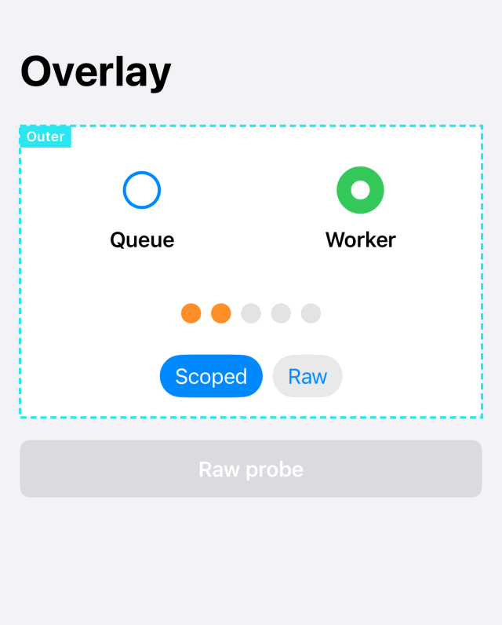
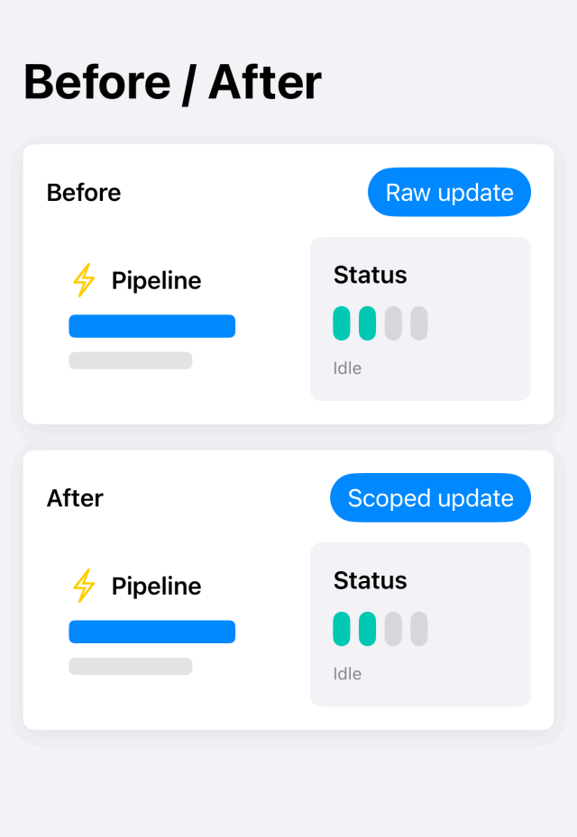
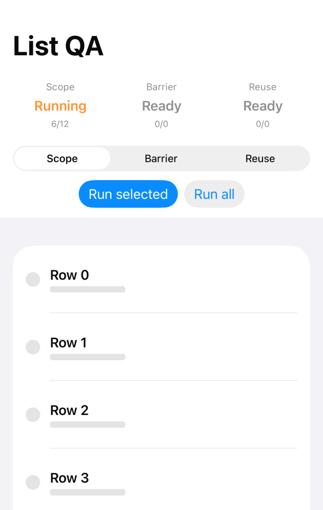

# ScopedAnimation

[日本語](README.md) | English

Declare which region owns an animation through the structure of your SwiftUI views.

<p align="center">
  <a href="https://github.com/9uiLe/swift-scoped-animation/actions/workflows/ci.yml"></a>
  <a href="https://swiftpackageindex.com/9uiLe/swift-scoped-animation"></a>
  <a href="https://swiftpackageindex.com/9uiLe/swift-scoped-animation"></a>
  <a href="LICENSE"></a>
</p>

<p align="center">
  
</p>

## Core model

SwiftUI uses `Transaction` to carry animation information to views during state
updates. ScopedAnimation places boundaries along that path.

- A **scope** removes incoming animation and supplies its own when a value changes
  or an explicit action requests it.
- A **barrier** removes incoming animation without supplying an animation of its own.
- A **stamp** is internal metadata identifying the animation's owner. DEBUG
  diagnostics report unstamped animation passing an observation point.

Views that read changed state update both inside and outside a scope. Transactions
from explicit proxy actions also reach regions without boundaries. Place a scope
or barrier around each region that should reject incoming animation.

## Installation

- iOS 17+, macOS 14+, tvOS 17+, watchOS 10+, visionOS 1+
- Swift 6 language mode, Swift tools 6.2+
- Swift Package Manager, no external dependencies

Add this package URL in Xcode:

```text
https://github.com/9uiLe/swift-scoped-animation.git
```

In `Package.swift`, declare the dependency and add the `ScopedAnimation` product
to your target:

```swift
.package(url: "https://github.com/9uiLe/swift-scoped-animation.git", from: "0.2.1")
```

## Animate a value change

Wrap content in `AnimationScope` to animate it when the observed value changes.

```swift
import ScopedAnimation
import SwiftUI

struct ExpandableCard: View {
    @State private var isExpanded = false

    var body: some View {
        VStack {
            Button("Toggle details") {
                isExpanded.toggle()
            }

            AnimationScope(.spring(duration: 0.3), value: isExpanded, name: "Card") {
                VStack(alignment: .leading) {
                    Text("Revenue")
                    if isExpanded {
                        Text("Monthly details")
                            .transition(.opacity)
                    }
                }
            }
        }
    }
}
```

The first mount establishes a comparison baseline. A change to `isExpanded`
supplies the declared animation to the content. The boundary strips ancestor animation.

### Multiple conditions for one region

List value/animation pairs in priority order.

```swift
AnimationScope(
    name: "Board",
    triggers: [
        .animation(.easeOut(duration: 0.12), value: selectedPoints),
        .animation(.spring(response: 0.35, dampingFraction: 0.7), value: hintPoints),
    ]
) {
    BoardView()
}
```

When several values change together, the first changed trigger supplies the
animation for the entire subtree. DEBUG builds report ignored changes as
`multiTriggerConflict` warnings.

Values compare by array position, concrete type, and equality. Changing only the
name or animation settings does not trigger motion. Resizing establishes a new
baseline without animation while preserving content identity and local state.
Reordering compares values at their new positions. Keep the count and order stable
unless a structural change is intentional.

## Animate an explicit action

The content closure receives a proxy. Pass synchronous state changes to its
`animate` method.

```swift
AnimationScope(.snappy, name: "Disclosure") { scope in
    VStack {
        Button("Toggle") {
            scope.animate {
                isOpen.toggle()
            }
        }
        DisclosureContent(isOpen: isOpen)
    }
}
```

Use `scope.animate(.spring(duration: 0.4)) { ... }` to choose an animation for
that action. The proxy's stamp survives ancestor boundaries, allowing the scope
with the matching owner ID to restore its animation.

## Place boundaries

| Intent | Structure |
| --- | --- |
| Animate separate visual layers independently | Sibling scopes |
| Prioritize multiple conditions for one subtree | Multiple triggers in one scope |
| Give a descendant its own animation owner | Nested scopes |
| Remove incoming animation | `animationBarrier()` |
| Show a named DEBUG boundary without value-driven animation | An empty array in `AnimationScope(name:triggers:content:)` |

A nested scope strips ancestor animation and animates according to its own
triggers or proxy. DEBUG `crossScopeAnimationStrip` warnings identify this
stripping between scopes.

Apply a barrier as follows:

```swift
StatusPanel()
    .animationBarrier()
```

The barrier preserves stamps for descendants. Pass
`animationBarrier(warnsOnLeaks: false)` to suppress the DEBUG warning emitted when
it strips unstamped animation. A scope with an empty trigger array does not emit
this barrier warning.

A barrier does not reserve layout space. Use ordinary frame constraints for fixed
dimensions. SwiftUI animation modifiers below a boundary can generate their own animation.

## DEBUG diagnostics

```swift
RootView()
    .detectAnimationLeaks()
    .animationScopeDebugOverlay()
```

Detectors report animated transactions without a scope stamp. The overlay draws
scope boundaries and names. Diagnostic implementations compile out of RELEASE builds.

| Source | Root detector | Detector or barrier downstream of the source |
| --- | --- | --- |
| Unstamped `withAnimation` / animated `withTransaction` | Detects passing transactions | Detects passing transactions |
| Raw `.animation(_:value:)` below the root | Cannot observe it | Detects passing transactions |
| Stamped transaction | No leak report | No leak report |

Coverage depends on placement. Use detectors at screen roots and subtrees under
investigation, and review direct animation calls. Code searches must distinguish
SwiftUI modifiers from the `AnimationTrigger.animation(_:value:)` factory.

## Performance and verification

Scopes identify the intended animated subtree. They do not control state
invalidation, `body` evaluation counts, or frame rate. Trigger construction and
equality have costs; use small values that fully represent the condition.
The [performance guide](Sources/ScopedAnimation/Documentation.docc/PerformancePlaybook.md)
covers application profiling; [reference measurements](docs/performance.md)
cover internal CPU costs.

Hosted tests verify transaction propagation on macOS and iOS. Verify `List` row
propagation, reuse, and rendering in each environment with the
[sample QA procedure](Examples/QA.md). Recheck the
[compatibility assumptions](docs/swiftui-assumptions.md) for major OS or Xcode updates.

## Sample app

The sample provides comparison, overlay, list verification, and multi-trigger
screens. Its UI is Japanese. The GIFs show demonstrations recorded with an English UI.

<p align="center">
  
  
</p>

```sh
xcodebuild build \
  -project Examples/ScopedAnimationExample/ScopedAnimationExample.xcodeproj \
  -scheme ScopedAnimationExample \
  -destination 'platform=iOS Simulator,name=iPhone 17'
```

## Documentation

Japanese is the repository's primary language. English editions are maintained
for README, CONTRIBUTING, SECURITY, and CODE_OF_CONDUCT. The
[contribution guide](CONTRIBUTING.en.md#language-policy) defines document ownership
and synchronization. Detailed guides, DocC, API comments, and diagnostics use Japanese.

| Topic | Document |
| --- | --- |
| API usage | [Getting started](Sources/ScopedAnimation/Documentation.docc/GettingStarted.md) and [composition](Sources/ScopedAnimation/Documentation.docc/Composition.md) |
| Transaction flow | [How it works](Sources/ScopedAnimation/Documentation.docc/HowItWorks.md) |
| Product contracts, internal structure, roadmap | [Design](HANDOFF.md) |
| Development, tests, document maintenance | [Contributing](CONTRIBUTING.en.md) |
| Version preparation and publication | [Release guide](docs/releasing.md) |
| Environments, actual output, verification limits | [Validation record](docs/validation.md) |
| Reporting and participation | [Security policy](SECURITY.en.md) and [code of conduct](CODE_OF_CONDUCT.en.md) |

Build DocC with Xcode:

```sh
xcodebuild docbuild -scheme ScopedAnimation -destination 'generic/platform=iOS'
```

## License

[MIT](LICENSE)
