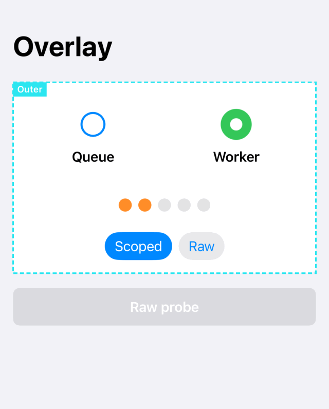
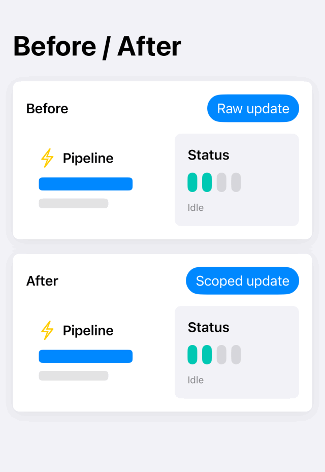
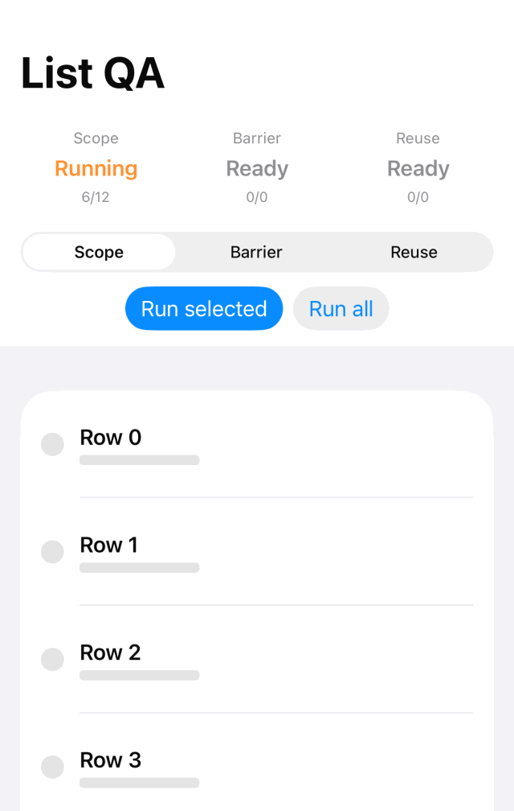

# ScopedAnimation

Structural boundaries and DEBUG diagnostics for SwiftUI animation.

<p align="center">
  
</p>

<p align="center">
  
  
</p>

ScopedAnimation helps you make animation ownership visible. It blocks incoming animation at explicit boundaries, stamps animation created by `AnimationScope`, and reports unstamped animation transactions in DEBUG builds.

It is not total animation containment. SwiftUI state updates can still affect every view that reads changed state. The library is about **blocking + detection**.

## Requirements

- Swift 6 language mode
- iOS 17+
- macOS 14+
- tvOS 17+
- watchOS 10+
- visionOS 1+
- No external dependencies

## Installation

Add the package in Xcode:

```text
https://github.com/9uiLe/swift-scoped-animation.git
```

Or add it to `Package.swift`:

```swift
.package(url: "https://github.com/9uiLe/swift-scoped-animation.git", from: "0.1.0")
```

Then add `ScopedAnimation` to the target dependencies.

## Quick Start

Value-driven scope:

```swift
import ScopedAnimation
import SwiftUI

AnimationScope(.spring(duration: 0.3), value: isExpanded, name: "Card") {
  CardContent(isExpanded: isExpanded)
}
```

Proxy-driven scope:

```swift
AnimationScope(.snappy, name: "Disclosure") { scope in
  DisclosureContent(isOpen: isOpen)
    .onTapGesture {
      scope.animate {
        isOpen.toggle()
      }
    }
}
```

Barrier:

```swift
LegacyDashboard()
  .animationBarrier()
```

Diagnostics:

```swift
RootView()
  .detectAnimationLeaks()
  .animationScopeDebugOverlay()
```

Diagnostics are DEBUG-only and compile out of RELEASE builds.

## Detection Accuracy

| Leak source | Root detector | Subtree detector / barrier sensor |
| --- | --- | --- |
| Raw `withAnimation` or unstamped `withTransaction` | Detected with high confidence | Detected |
| Raw `.animation(_:value:)` outside a scope | Not detected when the transaction is created below the detector | Detected if the detector is downstream of the source |
| Scoped transaction with a stamp | Not reported | Not reported |

Raw `.animation(_:value:)` has a known blind spot because SwiftUI can create that transaction below a root detector. Use three layers while debugging:

1. `animationBarrier()` sensors around static or legacy subtrees,
2. `detectAnimationLeaks()` on suspicious subtrees, and
3. static review or a future lint rule for raw `.animation(` usage.

## List Status

The example app includes List QA. On iPhone 17 Simulator with iOS 26.5, Phase 1 QA verified that:

- `AnimationScope` wrapping `List` propagated scoped animation into row content,
- `animationBarrier()` stripped raw incoming animation in rows, and
- row behavior survived scrolling offscreen and back.

This depends on observed SwiftUI transaction propagation through `List`, not a documented Apple contract. Re-run the sample QA when adopting a new major Xcode or OS release.

## Example App

Build the sample app:

```sh
xcodebuild build \
  -project Examples/ScopedAnimationExample/ScopedAnimationExample.xcodeproj \
  -scheme ScopedAnimationExample \
  -destination 'platform=iOS Simulator,name=iPhone 17'
```

The sample contains:

- Before / After comparison
- DEBUG overlay demo
- List QA screen

## Documentation

DocC articles live in `Sources/ScopedAnimation/Documentation.docc/`.

Local DocC verification uses Xcode:

```sh
xcodebuild docbuild -scheme ScopedAnimation -destination 'generic/platform=iOS'
```

The package intentionally does not depend on `swift-docc-plugin`.

## License

MIT. See `LICENSE`.
